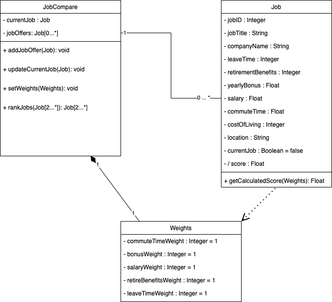
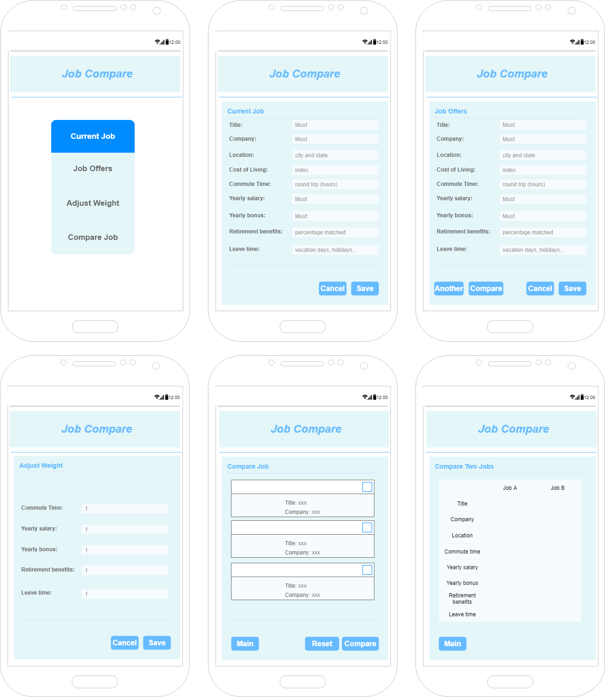

# Design Document

## 1 Design Considerations

### 1.1 Assumptions

* Android device is required
* User has job offers
* User is located in the United States
* User has basic proficiency in English

### 1.2 Constraints

* User must be located in the United States
* Basic English proficiency is required
* Application requires Android framework on the handheld device

### 1.3 System Environment

* The minimum API level for the application is API 28: Android 9.0 (Pie)
* The application will run on Android devices only

## 2 Architectural Design

### 2.1 Component Diagram

The JobCompare software application is a straightforward and simple application that exists as a single component. The following diagrams encapsulate the entire application and suitably cover its components.

### 2.2 Deployment Diagram

The software will be a self-contained Android application that is easy to deploy and/or download to Android devices and thus requires no deployment diagram.

## 3 Low-Level Design

### 3.1 Class Diagram

## 4 User Interface Design

