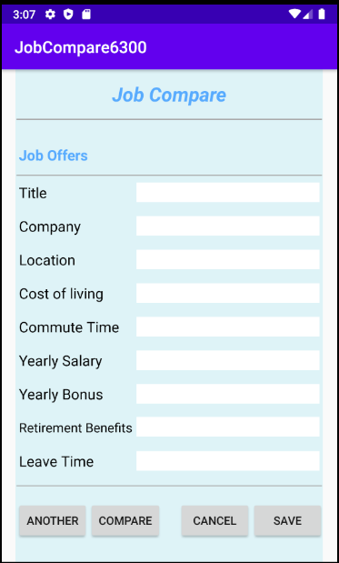
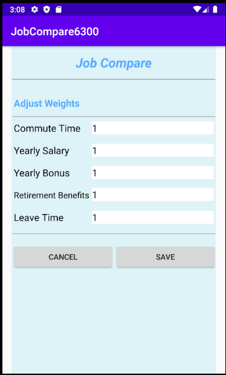

# User Manual

## 1 Overview

The JobCompare6300 App is designed to easily compare your current job against other job offers you have received based on location, salary, retirement benefits, and more. All Jobs need to be located in the United States.

## 2 Install App

Search and install **JobCompare**6300 on GooglePlay. Then you will see the shortcut icon on the device screen.

## 3 Introduction to Main page

Run the App, you will see this main page. There are four buttons you can click on: **CURRENT JOB, JOB OFFERS, ADJUST WEIGHTS, COMPARE JOBS**. Each of these button can lead you to their specific page.

## 4 Add Current Job 
Click **CURRENT JOB** button from the main page to enter Current Job page. If you have not saved any current job information before, you can input all information in the blanks. If you have saved current job information, this page will show you all the information of the saved current job. You can modify exist current job information and save it again.  

For each blank, detail requirements as below:

- Title: input the title of your current job
- Company: input the company name of your current job
- Location: entered as city and state
- Cost of Living: expressed as an [index](https://www.expatistan.com/cost-of-living/index/north-america)
- Commute Time: round-trip and measured in hours
- Yearly Salary: input yearly salary of your current job
- Yearly Bonus: input yearly bonus of your current job
- Retirement Benefits: entered as percentage matched
- Leave Time: vacation days and holiday and/or sick leave, as a single
  overall number of days

After fill all of the blanks, click **SAVE** button if you want to save the information and it will return to main page. Or click **CANCEL** button and all filled information will not be saved, page will go to the main page.

## 5 Add Job Offers

Click **JOB OFFERS** button from the main page to enter Job Offers page. The requirement of the job offers information is the same as current job information. There are four buttons: **ANOTHER**, **COMPARE**, **CANCEL** and **SAVE**.

- **ANOTHER**: Page will refresh and show a new Job Offers page for you to add another job offer information.
- **COMPARE**: If there are already two or more job offers information, this button will present, otherwise, it will be disabled. Once clicked on **COMPARE** button, page will go to Job Selection page.
- **CANCEL**: Click this button and all the information you entered will not be saved. Page will return to the main page.
- **SAVE**: After you fill all of the information in the blanks, if you want to save the information, you can click **SAVE** button.

## 6 Adjust Weights 

Click **ADJUST WEIGHTS** button from the main page to enter Adjust Weights page. All weights are initially set to be 1. You can modify your weights and click **SAVE** button to adjust your weights. Or you can click **CANCEL** button and all of the weights you have modified will not be saved. Both buttons will lead to the main page.

## 7 Compare Jobs 

Click **COMPARE JOBS** button from the main page to enter Job Selection page. In this page, it shows a list of job offers information, ranked from best to worst. Current job information will be displayed if it is exist in your App database. Select two of the jobs and click **COMPARE** button, page will go to Job Comparison page. Or click **REST** button to reset your choice. Click **MAIN** button to go to the main page.

Job score is computed as the weighted sum of the:

AYS + AYB + (RBP * AYS) + (LT * AYS / 260) - (CT * AYS / 8)

Where:

AYS = yearly salary adjusted for cost of living
AYB = yearly bonus adjusted for cost of living
RBP = retirement benefits percentage
LT = leave time
CT = commute time
The rationale for the CT subformula is:
a. value of an employee hour = (AYS / 260) / 8
b. commute hours per year = CT * 260
c. therefore commute-time cost = CT * 260 * (AYS / 260) / 8 = CT * AYS / 8 

## 8 Compare Jobs 

Click **COMPARE** button from Job Selection page to enter Job Comparison page. This page shows a table comparing the selected two jobs information. Click **MAIN** button, page will go to the main page.

## 9 Technical support 

If you have any problems with your JobCompare6300 App, please contact reseller you purchased from, or you can e-mail our technical support team: lilactp@gmail.com .

